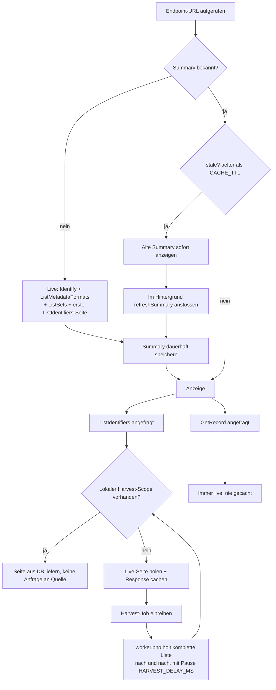

# OAI-PMH Explorer

Ein OAI-PMH-Client im Browser. Die App verbindet sich mit einem OAI-PMH-Endpoint, liest Repository-Metadaten, lädt Identifier-Listen mit Filtern und zeigt einzelne Records inklusive Raw-XML an.

## Was ist das?

Dieses Repository enthaelt eine Web-App mit:

- Frontend in `index.html`, `app.jsx`, `styles.css`
- PHP-Backend in `api.php` als Proxy/Parser für OAI-PMH
- Permanenter Repository-Summary-Cache, Kurzzeit-Response-Cache und optionaler Background-Identifier-Harvest in SQLite oder Postgres
- Docker-Compose-Stack mit Nginx, PHP-FPM, Worker und Postgres

Die App nutzt im Browser React & Babel Standalone (ohne Build-Step).

## Wie funktioniert es?

1. UI nimmt eine OAI-PMH-Base-URL entgegen.
2. Frontend ruft `api.php` mit `action`-Parametern auf.
3. `api.php` spricht den entfernten OAI-PMH-Endpoint an (`Identify`, `ListMetadataFormats`, `ListSets`, `ListIdentifiers`, `GetRecord`).
4. XML wird serverseitig geparst und als JSON an das Frontend geliefert.
5. Repository-Summaries werden dauerhaft gespeichert, damit bekannte Endpoints sofort ohne Connecting-Screen oeffnen.
6. Kleine OAI-Antworten werden zusaetzlich kurzzeitig per URL-Hash zwischengespeichert.
7. `ListIdentifiers` paginiert on demand ueber den vom Repository gelieferten `resumptionToken`.

Wichtig: Ganze Records und XML-Payloads werden nicht im Harvest-Cache gespeichert.

### Caching-Flow



`GetRecord` ist nie gecacht: ein Record kann sich jederzeit aendern, User soll aktuellen Stand sehen.

SQLite und Postgres verhalten sich hier identisch — beide sind nur die Storage-Engine hinter denselben Cache-Funktionen (`get_cached`, `store_cache`, `get_endpoint_summary` usw.). Unterschiede gibt es nur intern bei Migrationen und Datentypen (z. B. Boolean-Handling), nicht im Caching-Verhalten selbst.

## Voraussetzungen

- PHP 8.x
- PHP-Extensions: `dom`, `pdo_sqlite` oder `pdo_pgsql` (optional `curl`, sonst Fallback via `file_get_contents`)

## Development Server starten (einfach)

Im Projekt-Root ausfuehren:

```bash
php -S 127.0.0.1:8000
```

Dann im Browser oeffnen:

```text
http://127.0.0.1:8000
```

Hinweis: Ein reiner statischer Server reicht nicht, da `api.php` serverseitig ausgefuehrt werden muss.

## Docker-Compose-Stack starten

```bash
docker compose up --build
```

Dann im Browser oeffnen:

```text
http://127.0.0.1:8080
```

Der Stack startet:

- `nginx`: HTTP-Einstieg
- `php`: PHP-FPM fuer `api.php`
- `worker`: optionaler Background-Harvest fuer Identifier
- `postgres`: Harvest- und Cache-Datenbank

## .env Konfiguration (Timeouts etc.)

`api.php` liest optional eine `.env` im Projekt-Root.

Beispiel:

```env
APP_ENV=development
FETCH_TIMEOUT=60
CACHE_TTL=7200
OAI_USER_AGENT=OAI-PMH-Explorer/3.0.2
HARVEST_DELAY_MS=1000
HARVEST_MAX_SCOPE_ENTRIES=1000000
```

Bedeutung:

- `APP_ENV`: `development` oder `production`
- `FETCH_TIMEOUT`: Timeout fuer OAI-HTTP-Requests in Sekunden
- `CACHE_TTL`: Lebensdauer fuer Kurzzeit-Response-Cache und Schwelle fuer Summary-Refresh
- `OAI_USER_AGENT`: User-Agent fuer OAI-Requests
- `DATABASE_URL`: optionaler PDO-DSN; leer nutzt SQLite in `cache.sqlite`
- `HARVEST_DELAY_MS`: Pause zwischen Harvest-Seiten
- `HARVEST_MAX_SCOPE_ENTRIES`: Maximalzahl Identifier pro Harvest-Scope
- `HARVEST_MAX_INACTIVE_DAYS`: inaktive Scopes werden geloescht

## Projektstruktur

```text
.
|- api.php
|- lib.php
|- worker.php
|- app.jsx
|- index.html
|- styles.css
|- docker-compose.yml
|- Dockerfile
|- cache.sqlite
```

## API-Aufrufe des Frontends

Alle Requests gehen gegen:

```text
api.php?action=<action>&url=<base-url>
```

Unterstuetzte `action`-Werte:

- `identify`
- `listMetadataFormats`
- `listSets`
- `listIdentifiers`
- `getRecord`

Weitere Query-Parameter je nach Action:

- `prefix`
- `set`
- `from`
- `until`
- `resumptionToken`
- `identifier`

Cache umgehen (nur Entwicklung):

```text
http://127.0.0.1:8000/?nocache=1
```

Wichtig: Der `nocache`-Parameter ist nur aktiv, wenn `APP_ENV != production`.

## Sync from CLI

Optional zeigt die Explore-Ansicht ein `uvx ometha`-Kommando fuer die aktuellen Filter. Das ruft `ometha` direkt mit passenden OAI-PMH-Parametern auf:

```bash
uvx ometha default -p 1 --baseurl https://example.org/oai --metadataprefix oai_dc --set example:set --fromdate 2024-01-01 --untildate 2024-12-31
```

Nur gesetzte Filter werden ins Kommando uebernommen.

## Sonstige Hinweise

- Bei nicht erreichbaren Hosts liefert die API `kind: "unreachable"`.
- Bei nicht-OAI/XML-Antworten liefert die API `kind: "not-oai"`.
- `ListSets` kann serverseitig abgeschnitten sein; das wird als `truncated` zurueckgegeben.
- Repository-Summaries bleiben dauerhaft gespeichert; nach `CACHE_TTL` werden sie beim Wiederbesuch im Hintergrund aktualisiert.
- `resumptionToken`-Werte koennen serverseitig ablaufen; dann muss die Identifier-Liste ab Seite 1 neu geladen werden.

## Deployment (einfach)

Die App laeuft auf jedem Webserver mit PHP-Unterstuetzung. Fuer Background-Harvest wird der Docker-Compose-Stack oder ein eigener PHP-CLI-Worker empfohlen:

```bash
php worker.php
```

Wichtig:

- Dokumentenroot auf dieses Verzeichnis
- Schreibrechte fuer `cache.sqlite` bei SQLite-Fallback oder Postgres-Verbindung via `DATABASE_URL`

## Lizenz

MIT. Siehe [LICENSE](LICENSE).
